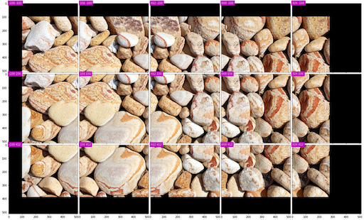

[](https://travis-ci.org/vfdev-5/ImageTilingUtils)
[](https://coveralls.io/github/vfdev-5/ImageTilingUtils?branch=master)
[](http://imagetilingutils.readthedocs.io/en/latest/?badge=latest)

# Image Tiling Utils
Minimalistic set of image reader agnostic tools to easily iterate over large images

**Example 1**

Let's iterate over a large image with overlapping and extracting always the 
same size tiles (in pixels).  Let's assume the data access is provided with an example function
```python
def read_data(x, y, width, height, out_width=None, out_height=None):
    out_width = width if out_width is None else out_width
    out_height = height if out_height is None else out_height    
    img.read(x, y, width, height, out_width, out_height)
``` 
Thus, overlapping tiles can be extracted as  
```python
from tiling import ConstStrideTiles


tiles = ConstStrideTiles(image_size=(500, 500), tile_size=(256, 256), 
                         stride=(100, 100))
                       
print("Number of tiles: %i" % len(tiles))
for extent, out_size in tiles:
    x, y, width, height = extent
    data = read_data(x, y, width, height, 
                     out_width=out_size[0], 
                     out_height=out_size[1])
    print("data.shape: {}".format(data.shape))
    
# Access a tile:
i = len(tiles) // 2 
extent, out_size  = tiles[i]
```




## Installation:

#### from pip
```bash
pip install tiling
```

#### from sources
Package installation is very simple
```bash
pip install git+https://github.com/vfdev-5/ImageTilingUtils.git
```

## Examples 

For more practical examples, see this [notebook](examples/example_const_stride_tiling.ipynb)
